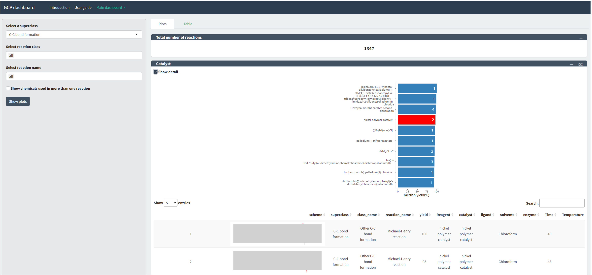

# Portfolio

## Work Projects
### Prototype of web application: Intelligent Chemical Route Assessment
#### Key Features 
- Visual representation of chemical synthesis tree.
- Standardized data input through a configured database.
- Automated metrics calculation and visualization.

  
### Chemical Reaction Dashboard
#### Key Features 
- Interactive visualiztion of chemical reaction experiment data.
- Incorporation of cleaned literature data.

## Capstone Projects for Master Courses

