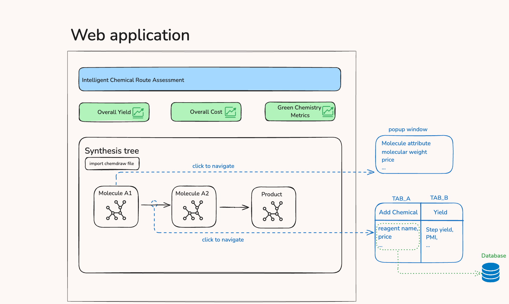
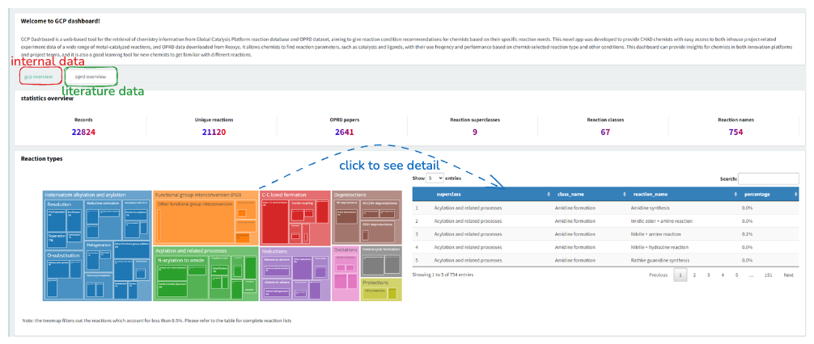
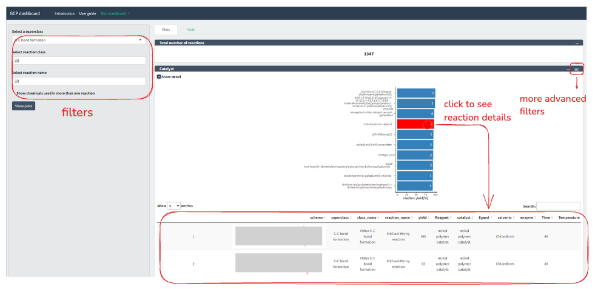
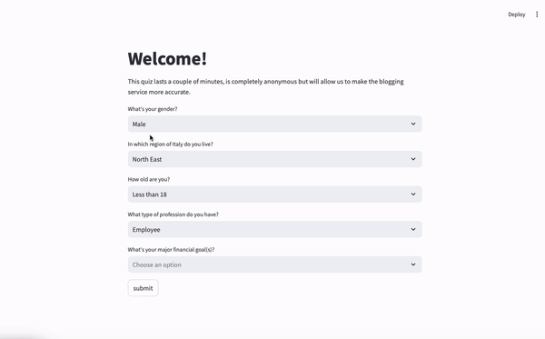
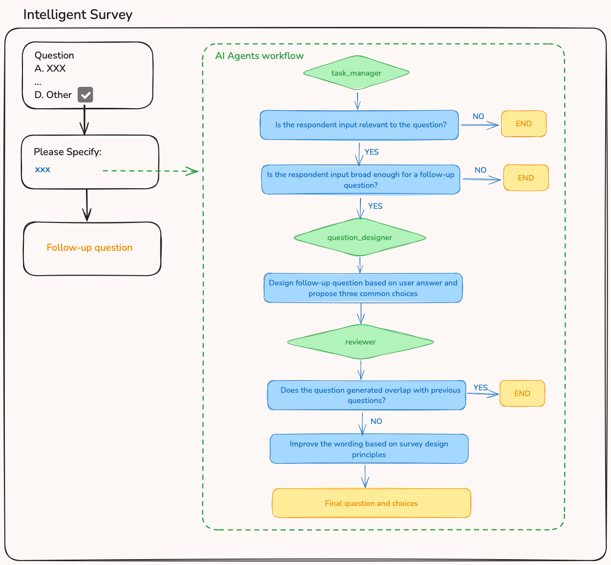
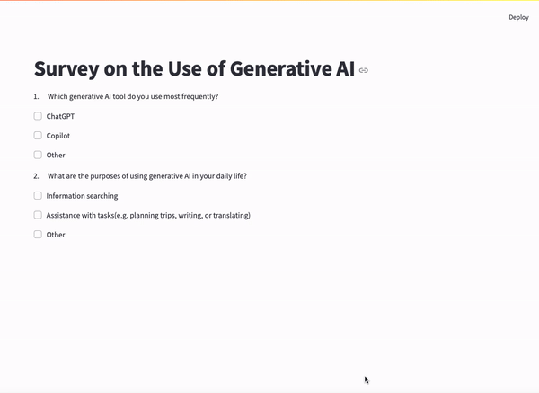

# Portfolio
## Work Projects
### Prototype of web application: Intelligent Chemical Route Assessment Platform
#### Key Features 
- Automatically parse imported file and give visual representation of chemical synthesis tree.
- Standardized data input through a chemical database.
- Automated metrics calculation and visualization.

#### My role
- Designed and developed prototype with R Shiny.
- Collected and cleaned chemical reagent data from various sources, establishing the first standardized database.
- Translated methodologies from academic papers and Excel files into algorithms with R and Python.
- Collaborated with software development vendors as a product manager to oversee and guide development processes.

  
### Chemical Reaction Dashboard
#### Key Features 
- Interactive visualiztion of chemical reaction experiment data.
- Incorporation of cleaned literature data.

#### My role
Collected, cleaned and analyzed data, designed and developed the dashboard. 

## Master thesis
### Affecting Client Attitudes: An Application of Behavioral Nudges to Information Campaigns by Financial Institutions
#### Abstract
Financial institutions strive to persuade clients to adopt a more strategic, long-term approach to managing their wealth, benefiting both clients and institutions. This paper aims to investigate whether minimal information nudges can lead individuals to shift from savings to investments. We conducted an online experiment where 345 Italian adults were assigned randomly to three information nudges and a control condition. Results showed that a simple storytelling nudge was particularly effective among young males, prompting them to seek more investment information. The nudge including social influence cues was also effective in certain conditions. Notably, nudges were most impactful among young people, those over 65, and non-working respondents—groups typically less interested in investments. These findings suggest that nudging can be a cost-effective approach for financial institutions to design information campaigns.    
#### Improvement idea
The storytelling nudge targeted at old males showed opposite effect, decreasing their interest in seeking further information. The potential cause of this backfire is the failure to invoke participants’ identification with the story character. With the large language models, it is possible to present personalized stories based on socio-demographic information of experiment subjects rather than four pre-written rigid stories that failed to resonate with every subject.   
[see codes](https://github.com/claudiatang95/storynudge)
#### Demo

## Master course project
### Communication on Twitter during 2020 Coronavirus Outbreak
#### Key Features 
- Collected English tweets with hashtag #coronavirus every two days from 25 January to 12 February with R rtweet package. In total 261745 tweets were collected.
- Explored and classified topics of 200 most popular tweets using GPT-4o model and few-shot prompt.
- Compared classification performance between GPT-4o and word embeddings.

#### Key Findings
- During early stages of Covid-19 outbreak, the most popular tweets largely focused on updates of pandemic, personal opinions, individual stories and public reactions.Information on preventive measures accounted for a smaller proportion.
- The misinformation that covid-19 was a bioweapon or human-made began to receive attention.
- Word embeddings was a more “cautious” approach as it tended to classify ambiguous text to the dominant category. GPT-4o was more “explorative” and less influenced by category imbalance, yielding higher accuracy and F1 score.

[see codes](https://github.com/claudiatang95/Twitter_Coronavirus/tree/master/classification_2024)      
[see complete report](https://drive.google.com/file/d/1VhSvPv0uvM2gdfdG5rynnqf3b66IfAdU/view?usp=share_link)

## Personal Projects
### AI-powered Follow-up Question Design in Structured Survey
#### Abstract
This study introduces an innovative approach to designing dynamic follow-up question in structured survey based on respondents’ input. To demonstrate the feasibility of this concept, a multi-agent AI workflow was designed and a demo application was developed with ChatGPT model. This approach aims to enhance the depth of data collection by generating tailored follow-up questions, particularly for respondents selecting the “Other” option, allowing for more flexible and richer survey responses.    
#### Introduction
In traditional surveys, respondents are given predefined answer choices for each question, with an “Other” option to capture responses that fall outside these categories. However, when respondents choose “Other”, it is often not feasible to ask follow-up questions, as there are no predefined ones for this option, limiting the richness of the data collected.    
With the advent of generative AI, many traditional research methods can be enhanced to improve their capabilities. As one of the most common quantitative research methods, survey presents opportunity for AI integration, where AI can play a significant role not only in data analysis, but also in data collection through dynamic intelligent question design.    
This study aims to explore how generative AI can be employed to address the limitation in survey by designing follow-up questions tailored to respondents’ unique input in the “Other” option. By leveraging AI’s ability to understand and generate human language, researchers can gain more insights, especially in exploratory studies where the predefined choices may not fully capture the range of potential responses.  

#### AI Agents
To demonstrate the feasibility of generating dynamic follow-up questions with generative AI, I designed a multi-agent AI workflow, as illustrated in the following figure. This workflow includes three agents:      
- Task manager: decides whether the follow-up question is necessary based on two criteria: a. Whether the respondent’s input is relevant to the question. b. Whether the input is broad so the follow-up question should be generated (it could be hard to define “broad”, which will be discussed in the discussion section).
- Question designer: design follow-up question and choices.
- Reviewer: a. Review whether the generated question repeats or overlaps with the previous questions b. Improve the wording based on survey design principles.

[see codes](https://github.com/claudiatang95/isurvey)          
[see complete report](https://drive.google.com/file/d/1CN1L7eKnIOe_yNsewZDVrgrO2Edhjgvh/view?usp=share_link)

  
#### Demo

